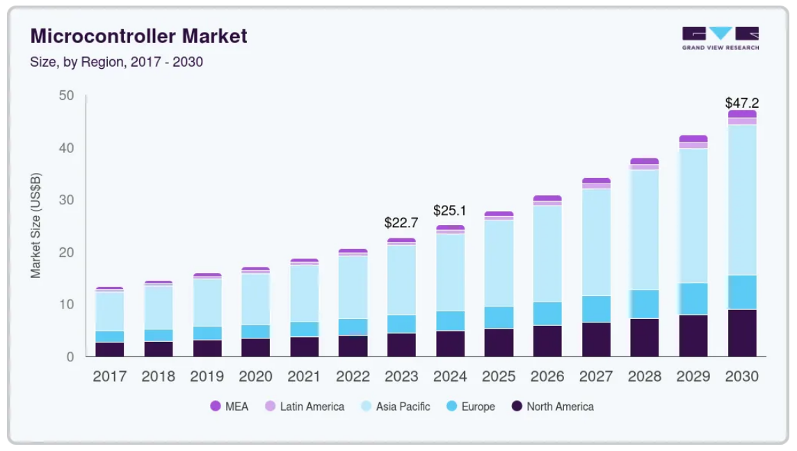
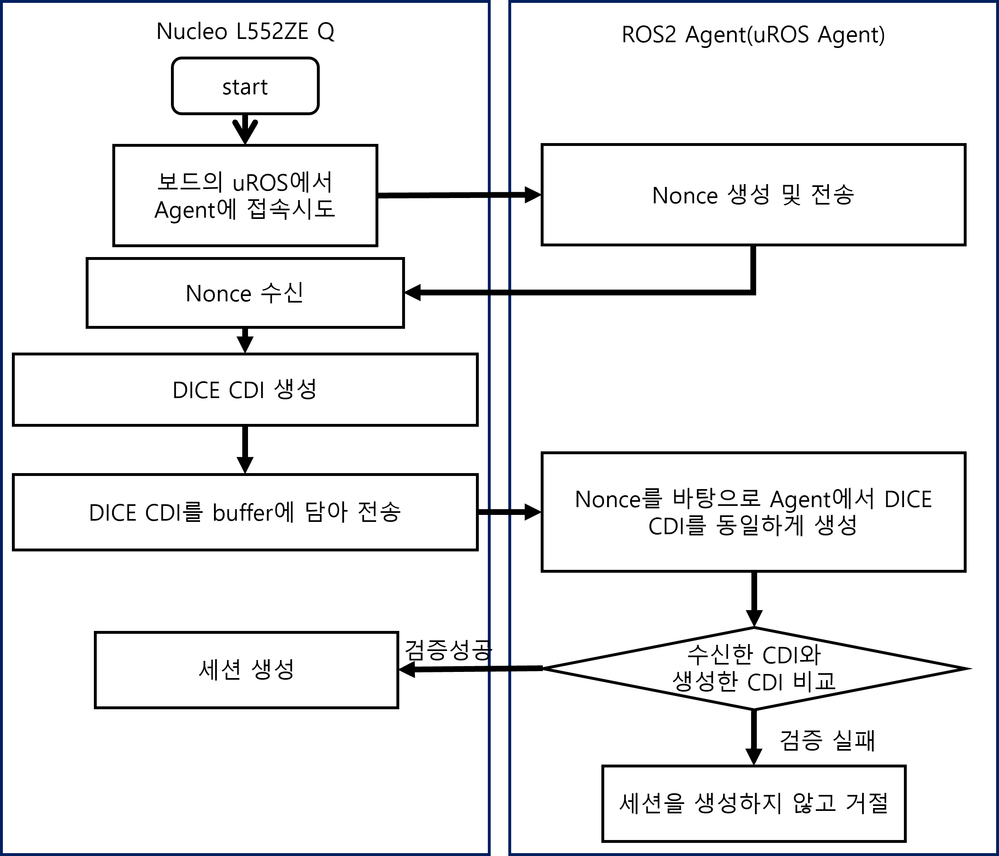
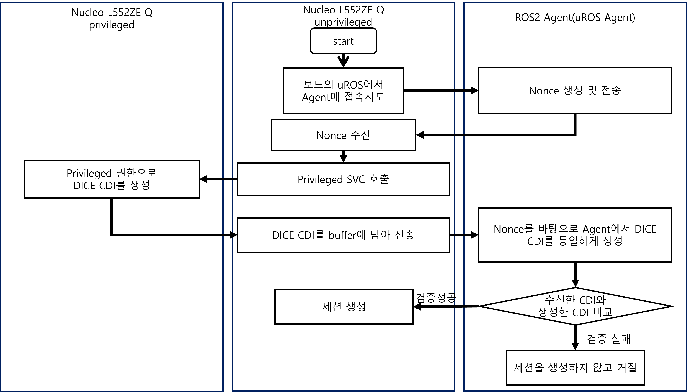
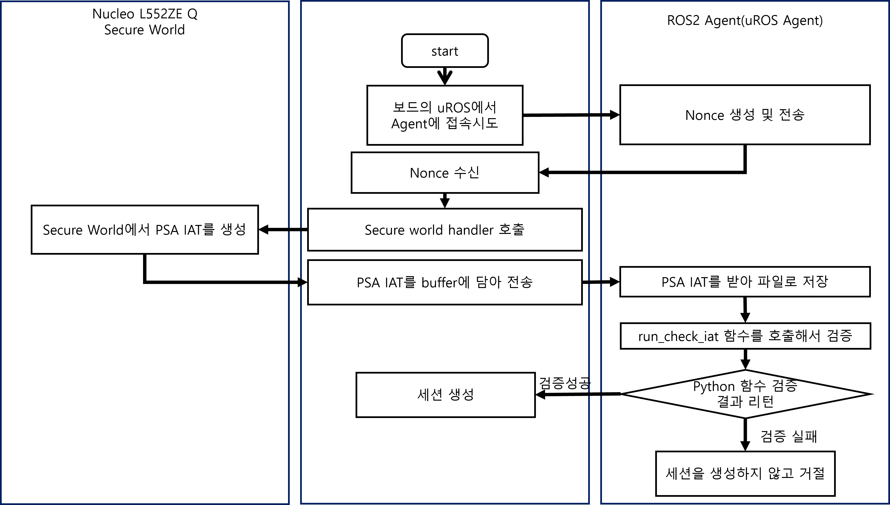

# 마이크로 컨트롤러에서의 안전한 로봇 어플리케이션 수행을 위한 원격 증명 기술 개발
## 1. 연구 배경
### 1.1. 사전 조사
<a name="figure1"></a>


최근 사물 인터넷(IoT)과 로봇 기술의 발전으로 MCU(Micro Controller Unit)는 단순 제어를 넘어 자율주행, 스마트 팩토리 등 복잡하고 중요한 역할을 수행하게 되었습니다. 이러한 역할 확대에 힘입어 MCU 시장은 [Figure 1](#figure1)과 같이 지속적인 성장이 전망됩니다. MCU는 센서 데이터 수집, 통신 등 시스템의 핵심 기능을 담당하지만 크기와 전력 소비를 최소화하기 위해 연산 능력과 메모리가 제한적이라는 특징을 가집니다. 이로 인해 일반 컴퓨팅 환경의 복잡한 보안 프로토콜을 적용하기 어려워 악의적인 공격에 취약합니다. 만약 MCU의 소프트웨어가 변조될 경우 시스템 오작동을 넘어 물리적 파손이나 심각한 인명 피해로 이어질 수 있어 자원 제약 환경에 최적화된 경량 무결성 검증 기술 확보가 필수적입니다[[1]](#ref1).

### 1.2. 기존의 문제점
- Micro-ROS[[2]](#ref2) 및 ROS2[[3]](#ref3)의 보안 기능 미흡: 경량화에 초점을 맞춘 Micro-ROS는 인증, 암호화 같은 보안 기능이 충분히 구현되어 있지 않으며 저사양 MCU에서는 추가적인 자원 요구로 인해 보안 기능 구현 자체가 어렵습니다. 또한 하나의 노드가 탈취되면 연결된 모든 기기가 위험에 노출되는 구조적 한계를 가집니다.

- 기존 원격 증명 기술의 한계: TPM(Trusted Platform Module)[[4]](#ref4)과 같은 전통적인 원격 증명 기술은 고성능 CPU와 전용 보안 칩이 필요해 MCU 환경에 적용하기 어렵습니다. 또한 ARMv8-M 아키텍처에 최적화된 TF-M 같은 기술은 대다수의 저사양 MCU가 지원하지 않아 범용성이 떨어집니다.

- 통신 보안의 부재: Micro-ROS의 핵심 통신 프로토콜인 DDS는 보안 기능이 기본적으로 미비하여 중간자(Man-in-the-Middle) 공격이나 Replay 공격에 쉽게 노출됩니다.

### 1.3. 필요성과 기대효과
본 연구는 자원이 제한된 MCU 기반 로봇 시스템의 보안 취약점을 해결하기 위해 필수적입니다. 로봇 시스템의 네트워크 연결성 증대는 보안 위협 증가로 이어지며 공격받을 경우 시스템 마비나 잘못된 제어 명령 전달로 심각한 안전 문제를 야기할 수 있습니다.

본 연구를 통해 MCU 환경에서도 원격 증명 기술을 효과적으로 적용할 수 있음을 입증하고 시스템의 보안 요구사항과 자원 제약에 따라 선택할 수 있는 
다각적인 보안 솔루션(DICE, DICE+MPU, TF-M+TZ-M)을 제시하는 데 의의가 있습니다. 이는 로봇 어플리케이션의 신뢰성과 안전성을 크게 향상시킬 것으로 기대됩니다.

## 2. 개발 목표
### 2.1. 목표 및 세부 내용
Micro-ROS의 통신 프로토콜인 Micro XRCE-DDS의 세션 생성 과정에 부팅 시점의 원격 증명 기술을 통합하여 안전한 보안 구조를 구현하는것이 목표이며 다음과 같은 3가지 Root of Trust 기반 보안 구조 설계 및 구현을 진행합니다.
- **DICE (Device Identifier Composition Engine)**[[5]](#ref5) 단독 구조

- **DICE (Device Identifier Composition Engine)** 와 **MPU (Memory Protection Unit)**[[6]](#ref6) 를 결합한 구조

- **TF-M (TrustedFirmware-M)**[[7]](#ref7) 과 **TZ-M (TrustZone-M)**[[8]](#ref8) 을 통합한 구조

추가적으로 기본 Micro-ROS와 구현한 3가지 구조의 통신 시간, board cycle, firmware size를 종합적으로 비교하여 자원이 제한된 MCU 시스템에서 원격 증명 기술이 실질적으로 동작하며 효과적임을 증명합니다.

### 2.2. 기존 서비스 대비 차별성 

- DDS Security+[[9]](#ref9)와의 차별점: 선행 연구인 DDS Security+는 TPM 하드웨어에 의존하지만, 본 연구는 TPM이 없는 자원 제약적 MCU 환경을 대상으로 합니다.

- SMART[[10]](#ref10)와의 차별점: SMART는 하드웨어 변경을 일부 요구하지만 본 연구는 기존 하드웨어의 MPU, TrustZone-M과 같은 기능을 최대한 활용하고 Micro-ROS 통신 프로토콜에 직접 보안 계층을 통합하여 실용성을 높였습니다.

### 2.3. 사회적 가치 도입 계획 
제조업, 유통, 의료 등 다양한 산업 분야에서 활용되는 로봇 시스템의 보안을 강화함으로써 악의적인 공격으로 인한 시스템 오작동 및 중단을 방지하고 로봇으로 인해 발생할 수 있는 물리적, 인명 피해를 예방하여 공공의 안전에 기여할 수 있습니다.

## 3. 시스템 설계
### 3.1. 시스템 구성도
시스템은 크게 세 부분으로 구성됩니다.
- 일반 PC/SBC: ROS 2 DDS 미들웨어가 동작하는 환경입니다.
- Micro ROS Agent: PC와 MCU 보드 사이에서 통신을 중개하는 XRCE-DDS 에이전트입니다.
- MCU 보드: FreeRTOS 또는 Zephyr와 같은 RTOS 위에서 Micro-ROS 노드가 실행되는 임베디드 장치입니다.

#### 3.2. 사용 기술
- 하드웨어
  - ST Nucleo-L552ZE-Q[[11]](#ref11) (Arm Cortex-M33, MPU 및 TrustZone-M 지원) 
- 운영체제
  - Zephyr RTOS[[12]](#ref12)
- 통신 미들웨어
  - Micro-ROS
  - Micro XRCE-DDS 
- 보안 기술
  - DICE (Device Identifier Composition Engine): 경량 신뢰 루트 프레임워크 
  - MPU (Memory Protection Unit): 하드웨어 메모리 접근 제어 기능 
  - TF-M (TrustedFirmware-M): Armv8-M을 위한 오픈소스 보안 펌웨어 
  - TZ-M (TrustZone-M): 하드웨어 수준의 보안 격리 기술 
- 개발 환경
  - Ubuntu 22.04 LTS
  - Python 3.10.12
  - Zephyr-SDK 0.17.0

## 4. 개발 결과
### 4.1. 전체 시스템 흐름도
#### 4.1.1. DICE 구현
<a name="figure2"></a>

[Figure 2](#figure2)와 같이 Nucleo-L552ZE-Q 보드에서 접속시도 패킷을 전송하면 Agent에서 Nonce 값을 생성한 후 전송한다.
이후 Board 측에서 수신한 Nonce를 가지고 DICE CDI를 생성한 후 전송한다. 사전에 화이트리스트로 저장된 펌웨어 hash를 바탕으로 Agent에서 똑같은 연산을 진행하고 이를 비교하여 세션 생성 여부를 결정한다.

#### 4.1.2. DICE+MPU 구현
<a name="figure3"></a>

[Figure 3](#figure3)는 DICE와 거의 유사한 과정을 가진다. 하지만 MPU를 사용하여 어플리케이션의 코드는 unprivileged 권한으로 동작하여 정해진 메모리 범위 외에 접근시에 fault를 발생시켜 메모리 영역을 보호하고 강화한다.
DICE CDI를 생성할 시엔 flash 영역 hashing을 진행하기에 custom SVC를 정의하여 privileged 권한으로 동작하도록 설정한다.

#### 4.1.3. TFM+TZM 구현
<a name="figure4"></a>

[figure 4](#figure4)는 위 두 구현과 다르게 TFM기반 Root of Trust를 구현하고 이를 바탕으로 Non-Secure world에서 Agent로 접속을 시도한다. Agent에서는 Nonce를 생성하여 전송하고 Board에서는 수신한 Nonce를 바탕으로한 PSA IAT를 발급한다. PSA IAT는 Secure world에서 발급되어 하드웨어 바탕 격리가 되어있다. 이를 호출하기 위해서는 전용 handler를 사용하여 호출하고 반환 받는다. 이를 Agent로 전송하면 Agent는 이를 저장하고 firmware를 build할때 사용한 비밀키를 사용하여 검증한다. 이 검증과정은 python의 의존성이 너무 강하여 내부적으로 python을 별도로 실행하여 검증결과를 반환받고 세션 생성 여부를 결정한다.


### 4.2. 기능 설명 및 주요 기능 명세서
[DICE 문서 참고](docs/04.명세/uROS-RA-졸업과제-명세_DICE.pdf)<br>
[MPU 문서 참고](docs/04.명세/uROS-RA-졸업과제-명세_MPU.pdf)<br>
[TFM 문서 참고](docs/04.명세/uROS-RA-졸업과제-명세_TFM.pdf)<br>
[TZM 문서 참고](docs/04.명세/uROS-RA-졸업과제-명세_TZM.pdf)


### 4.3. 디렉토리 구조
3가지 구현을 각 branch로 나누어 구성
- Micro-XRCE-DDS-Agent[[13]](#ref13)
  - 해당 폴더는 Micro-XRCE-DDS에서 사용하는 Agent 폴더이며 Micro-ROS에서 Agent 빌드 시 다운받아 사용하는 코드
  - [별도의 github 주소](https://github.com/tmdals010126/Micro-XRCE-DDS-Agent)로 구성되어 있음.
  - `src/cpp`에 소스코드가 존재
- Micro-ROS-Zephyr-TFM[[12]](#ref12)[[14]](#ref14)
  - Micro-ROS 모듈이 포함된 zephyr rtos가 구현되어있는 폴더로 firmware build 및 구성이 해당 폴더의 코드로 이루어짐
  - `micro_ros_dice` / `micro_ros_tfm` 폴더에 각 프로젝트가 존재
- Micro-ROS-Zephyr[[15]](#ref15)
  - Micro-ROS가 지원하는 개발 환경 폴더
  - 별도로 firmware를 build 할 수 있으나 모듈지원이 미미하여 해당 프로젝트에서는 firmware를 build하는데 사용하지 않음
  - 해당 프로젝트에서는 Agent를 build하고 사용하는데 사용됨
  - `src/uros/micro-ROS-Agent/micro_ros_agent` 폴더에 Agent 구현이 존재하며 `cmake/SuperBuild.cmake` 파일의 설정에 따라 `Micro-XRCE-DDS-Agent`를 다운받고 build함


### 4.4. 산업체 멘토링 의견 및 반영 사항
- 서버와 클라이언트 간 신뢰 기준(키)에 대한 설명 추가
  - DICE의 경우 UDS사용
  - TFM의 경우 빌드 시점에서 개인키 사용 및 토큰 검증시 사용
- Ethernet과 Serial 통신 경로에 대해 명확히 기술
  - 이번 과제에서는 Serial 통신을 기준으로 실험을 진행 
  - Ethernet을 사용하기 위해서는 별도의 모듈이 필요하기에 추가하지 않음

## 5. 설치 및 실행 방법

### 5.1. 설치절차 및 실행 방법
#### 5.1.1. zephyr 설치 (Client)
각 구현에 따른 branch에 맞춰 사용
공통
```bash
sudo apt update
sudo apt upgrade
sudo apt install --no-install-recommends git cmake ninja-build gperf \
  ccache dfu-util device-tree-compiler wget python3-dev python3-venv python3-tk \
  xz-utils file make gcc gcc-multilib g++-multilib libsdl2-dev libmagic1
```
```bash
cd zephyrproject/zephyr
source ../.venv/bin/activate
```
DICE
```bash
west build -p always -b nucleo_l552ze_q micro_ros_dice
west flash
```
DICE+MPU
```bash
west build -p always -b nucleo_l552ze_q micro_ros_dice
west flash
```
TFM+TFM
```bash
west build -p always -b nucleo_l552ze_q_ns micro_ros_tfm
west flash
```
#### 5.1.2. Agent
- [ros2 humble](https://docs.ros.org/en/humble/Installation.html) 설치 필요<br>
ros2 설치폴더 예시 `source ~/ros2_humble/install/local_setup.zsh`
```bash
source <ros2_humble 설치 폴더>/install/local_setup.zsh

cd uros
./rebuild_agent.sh
source install/local_setup.zsh
ros2 run micro_ros_agent micro_ros_agent serial -b 115200 \
--dev /dev/serial/by-id/<uart serial 장치> -v6
```
- uart serial 장치 예시 `/dev/serial/by-id/usb-STMicroelectronics_STM32_STLink_066EFF555187534867211812-if02`

### 5.2. 오류 발생 시 해결 방법
- board 사용시 TFM을 사용하게된다면 메모리맵이 보호되기에 다른 펌웨어를 사용하기 힘들다.
- TFM을 사용하게된다면 다음과 같은 명령어를 사용하여 보드를 초기화하여 다른 펌웨어를 사용가능하다. 사용하기 위해서는 STM32_Programmer_CLI 설치가 필요하다.
  ```bash
  STM32_Programmer_CLI -c port=SWD mode=UR -e all
  ```


## 6. 소개 자료 및 시연 영상
### 6.1. 프로젝트 소개 자료
> PPT 등
### 6.2. 시연 영상
> 영상 링크 또는 주요 장면 설명

## 7. 팀 구성
### 7.1. 팀원별 소개 및 역할 분담

<div>

|  |  |  |
| :------------------------------------------------------------------------: | :---------------------------------------------------------------------------: | :-------------------------------------------------------------------: |
| [**강승민**](https://github.com/tmdals010126)                               | [**김의준**](https://github.com/yeedwig)                               | [**박재선**](https://github.com/sunnypark87)                               |
| [**자기 소개**](https://veiled-lemming-857.notion.site/PROFILE-school-27831b4ff88480228fd9fb305a183d32?source=copy_link)                               | [**자기 소개**](https://time-walker-f84.notion.site/278b82d83c39800bbfb5c823cb8ce214?source=copy_link)                               | [**자기 소개**](https://feline-bite-26f.notion.site/278a868e440080a293cbd0bf18e92ec9)                               |
| - Agent side 검증 코드 개발 <br> - TrustedFirmware-M 사용 코드 개발 <br> - zephyr 코드 통합 및 실험 진행 | - zephyr 코드 이식 <br> - 성능 실험 결과 분석 <br> | - DICE 기능 개발 <br> - MPU 제어 기능 개발 <br>|

</div>

### 7.2. 팀원 별 참여 후기
<div>

| [강승민](https://github.com/tmdals010126) | [김의준](https://github.com/yeedwig)    | [박재선](https://github.com/sunnypark87) |
|:----------------------------------------:|:------------------------------------------:|:----------------------------------:|
| "이번 연구를 진행하며 임베디드 보안의 다양한 아키텍쳐를 이해하는 시간이 되어 매우 유익했던것 같습니다. 보안기능을 다루는 과제였기에 개발과 디버깅에 다소 어려움이 존재했지만 이를 극복하여 원하는 기능을 모두 구현하여 재밌는 경험이였습니다." | "이번 과제를 통해 임베디드 보안 전반에 대한 이해를 넓힐 수 있었고, 실제 구현에 도전하며 새로운 경험을 통해 배울 수 있었습니다." | "생소했던 임베디드 소프트웨어를 다루면서 어려움이 많았지만 하나씩 공부해가는 즐거움을 느낄 수 있었습니다. 그리고 보안의 중요성에 대해 다시 한 번 생각해볼 수 있는 기회였습니다." |

</div>

## 8. 참고 문헌 및 출처
[1] <a name="ref1"></a>B. Dieber, B. Breiling, S. Taurer, S. Kacianka, S. Rass, and P. Schartner, "Security for the robot operating system," *Robotics and Autonomous Systems*, Vol. 98, pp. 192-203, Dec. 2017.

[2] <a name="ref2"></a>The micro-ROS Consortium, "[micro-ROS](https://micro.ros.org/)," 2024. [Online]. Available: https://micro.ros.org/. [Accessed: Sep. 17, 2025].

[3] <a name="ref3"></a>Open Robotics, "[ROS 2 Documentation](https://docs.ros.org/)," 2025. [Online]. Available: https://docs.ros.org/. [Accessed: Sep. 17, 2025].

[4] <a name="ref4"></a>Trusted Computing Group and Microsoft, "[Official TPM 2.0 Reference Implementation](https://github.com/TrustedComputingGroup/TPM)," 2024.

[5] <a name="ref5"></a>Trusted Computing Group (TCG), "Device Identifier Composition Engine (DICE) Architectures," Revision 1.0, Aug. 2017.

[6] <a name="ref6"></a>Arm Limited, "[Arm Cortex-M33 Processor Technical Reference Manual - Memory Protection Unit](https://developer.arm.com/documentation/100235/0004/the-cortex-m33-peripherals/security-attribution-and-memory-protection/memory-protection-unit)," 2020.

[7] <a name="ref7"></a>Arm Limited, "[Trusted Firmware-M](https://www.trustedfirmware.org/projects/tf-m/)," 2024.

[8] <a name="ref8"></a>Arm Limited, "[TrustZone technology for Armv8-M Architecture](https://developer.arm.com/documentation/100690/0200/ARM-TrustZone-technology)," 2018.

[9] <a name="ref9"></a>P. G. Wagner, P. Birnstill, and J. Beyerer, "Dds security+: Enhancing the data distribution service with tpm-based remote attestation," in *Proc. 19th Int. Conf. Availab., Reliab. Secur.*, 2024, pp. 1-11.

[10] <a name="ref10"></a>K. Eldefrawy, et al., "Smart: secure and minimal architecture for (establishing dynamic) root of trust," in *Proc. Netw. Distrib. Syst. Secur. Symp. (NDSS)*, 2012, pp. 1-15.

[11] <a name="ref11"></a>STMicroelectronics, "[NUCLEO-L552ZE-Q](https://www.st.com/en/evaluation-tools/nucleo-l552ze-q.html)," 2021.

[12] <a name="ref12"></a>The Zephyr Project, "[The Zephyr Project](https://www.zephyrproject.org/)," 2025. [Online]. Available: https://www.zephyrproject.org/. [Accessed: Sep. 17, 2025].

[13] <a name="ref13"></a>eProsima, "[Micro-XRCE-DDS-Agent](https://github.com/eProsima/Micro-XRCE-DDS-Agent)," 2024.

[14] <a name="ref14"></a>micro-ROS, "[micro_ros_zephyr_module](https://github.com/micro-ROS/micro_ros_zephyr_module)," 2024.

[15] <a name="ref15"></a>micro-ROS, "[micro_ros_setup](https://github.com/micro-ROS/micro_ros_setup)," 2024.
